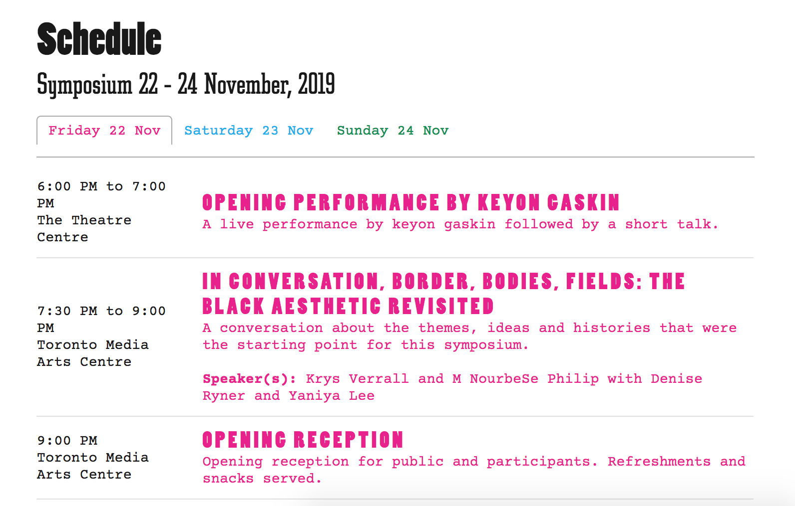

---

title: Bodies Borders Fields

date: "2019-11-01T22:12:03.284Z"

description: ""

siteLink: "https://www.bodiesbordersfields.com/"

githubLink: "https://github.com/caitlinhaaf/bodiesBordersFields-symposium"

---

### The Client

**[Trinity Square Video](https://www.trinitysquarevideo.com/)** is a Toronto arts organizaiton that provides artists with training and access to equipment to explore new media arts practices, including video and virtual/augmented reality. They also emphasize removing barriers for artists, and promoting diverse voices within the arts community

### Description

Bodies Borders Fields is an event series centered around conversations about black culture and the arts. From the Bodies Borders Fields site:

> [...] Bodies Borders Fields is a free, public symposium that re-imagines the 1967 conversation about “blackness” with particular attention to blackness and fugitivity as represented in critical art practices today [...] Bodies Borders Fields will dislocate the original panel discussion to contemporary contexts and representations of black and blackness in sound, performance and visual culture with respect to black social life and expression.

Trinity Square Video approached me before their first Bodies Borders Fields event, a 3 day symposium in November 2019. They were looking for a site where they could outline:

- Event venue details

- Event contributor photos and biographies

- Event schedule broken down by day

- Event resources, including links to videos and transcripts, readings etc.

The client already had the design for the event program, and they wanted the website to match this aesthetic.

*<!--  -->*

### **Solution**

Since I had worked with the team at Trinity Square Video previously on the [Virtual Grounds](http://caitlinhaaf.com/virtual-grounds) site, they were already familiar with the [Netlify CMS](https://www.netlifycms.org/), which they found straight forward and easy to work with. So I decided to stick with the Netlify CMS for this project as well, and built the front-end in [Gatsby JS](https://www.gatsbyjs.org/).

This project had a very quick turnaround time (about one week), so we kept the design and functionality very simple. The program design I was working to match was already very clean and simple, so using the [Gatsby Starter Blog](https://www.gatsbyjs.org/starters/gatsbyjs/gatsby-starter-blog/) template, I adjusted the fonts, colors, and design motifs like the green dotted borders from match the program design.

Blog post pages

### Takeaways

Since completing the project

- A more robust CMS may have been the better choice here, allowing for more variety in

- Length of videos when trying to upload

### Future Updates

- Adding video embedding

- Event schedule archive